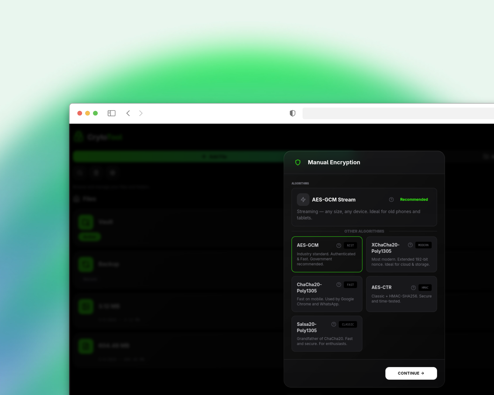

  
  <h1>CrytoTool</h1>
  
<strong>All-in-One Privacy.</strong>

   
    
   
     
   
      
   
   
  

  

|  Concept & Brand |  Interface Overview |
| :---: | :---: |
|  |  |
| *brand & animation* | *File Management* |

|  Advanced Security |  Deep Customization |
| :---: | :---: |
|  |  |
| *Multiple encryption algorithms* | *Themes & Personalization* |

CrytoTool respects the people behind the screen. It's a four-in-one, client-side encrypted file manager, gallery, music player, and document viewer where your privacy comes first: **no tracking, no ads, no data collection**.

File names, tags, and metadata are encrypted — not just file contents. It works independently of the operating system, fully sandboxed.

CrytoTool is compliant with the [Protocol-3305](https://github.com/ObscuritySecurity/protocol-3305) and respects all its principles.

### Architecture Overview

CrytoTool uses a 100% client-side architecture with 4 layers of encryption:

| Layer | What it does | Key detail |
|-------|----------------|------------|
| **1. Database Encryption** | Auto-encrypts every file in IndexedDB | AES-256-GCM, keys from Master Password via Argon2id |
| **2. File & Folder Encryption** | Manual encryption with 6 algorithms | AES-GCM, XChaCha20-Poly1305, ChaCha20-Poly1305, AES-CTR, Salsa20-Poly1305, AES-GCM-Stream |
| **3. Encrypted Backup** | Creates secure backups of all data | PBKDF2-SHA256 + AES-256-GCM, unique 26-char key |
| **4. Streaming Encryption** | Handles large files on any device | 4MB chunks, AES-GCM per chunk, safe for low-RAM devices |

For full technical details, consult the [Technical Architecture](https://github.com/ObscuritySecurity/CrytoTool/blob/main/architecture.md).

---

### Problems Solved

> **The main problem that CrytoTool solves** is that most file managers do not provide real security, everything is a facade, only with the system password can you access the most sensitive data. CrytoTool solves this problem through an isolated system and multiple layers of security.

> **The second problem it solves** is that most people are tired of having different apps for everything, especially in a file manager where you should have everything, look here we come — we offer gallery, music, documents and others in the future.

> **The third and last problem we solve** is that most file managers do not give you the option to choose from multiple encryption algorithms. CrytoTool gives you the option to choose from six encryption algorithms.

---
### Key Features

**Security**
-   **Master Password (30+ characters):** Secure your entire vault with a strong master password (minimum 30 characters).
-   **Progressive Lockout:** The app automatically locks for increasing durations after multiple failed password attempts.
-   **Settings Self-Destruct Password:** A separate, dedicated password with self-destruct capability to protect sensitive settings — if someone fails to guess it the configured number of times, all vault data is permanently wiped.
-   **Auto-Lock & Visual Obfuscation:** The app can automatically lock and blur the screen after a period of inactivity.
-   **Unique Key Per File/Folder:** Each file and folder is encrypted with its own unique encryption key, stored securely in the vault with progressive lockout protection.
-   **PIN Blacklist:** Common and weak PINs are blocked from use, preventing easy-to-guess combinations.
-   **Encrypted Backup Key:** Backups are protected with a unique, separate encryption key using PBKDF2-SHA256 and AES-256-GCM. For more details, see the [Technical Architecture](https://github.com/ObscuritySecurity/CrytoTool/blob/main/architecture.md) (Section 3).

**Recovery**
-   **10 Recovery Codes:** Generate 10 unique, single-use codes for emergency vault access.
-   **Unique Reset Token:** A single-use recovery token that allows you to reset your master password without losing your data.
-   **Encrypted Backups:** Create fully encrypted backups of all your data.

**Core Encryption**
-   **IndexedDB Encryption:** Files are automatically encrypted using AES-256-GCM with keys derived from your Master Password via Argon2id. For more details, see the [Technical Architecture](https://github.com/ObscuritySecurity/CrytoTool/blob/main/architecture.md) (Section 1).
-   **Metadata Encryption:** File names, tags, artist, album, and other sensitive metadata fields are encrypted using AES-256-GCM with the vault key. Metadata is stored as a single encrypted JSON blob alongside each file entry. See [metadataCrypto.ts](https://github.com/ObscuritySecurity/CrytoTool/blob/main/utils/metadataCrypto.ts).

**Manual & Streaming Encryption**
-   **Multi-Algorithm Support:** Encrypt files manually with 6 algorithms — AES-GCM, XChaCha20-Poly1305, ChaCha20-Poly1305, AES-CTR + HMAC, Salsa20-Poly1305, and AES-GCM-Stream for large files.
-   **Vault Key Storage:** Store generated encryption keys in an encrypted vault, categorized for easy access.
-   **Streaming Encryption:** Handles large files (600 MiB+) in 4 MB chunks with AES-GCM per chunk — safe for low-RAM devices.

**Deep Customization**
-   **Theme Gallery & Accent Colors:** Personalize the app's appearance with a rich theme gallery and a custom accent color picker.
-   **Multi-Language Support:** The interface is available in over 50 languages to provide a native experience for people worldwide.

---

### Documentation

Explore these guides to understand our project's principles, technical design, and how you can get involved.

-   [Code of Conduct](https://github.com/ObscuritySecurity/CrytoTool/blob/main/docs/CODE_OF_CONDUCT.md) Our pledge to maintain a harassment-free and inclusive community.
-   [Contributing Guide](https://github.com/ObscuritySecurity/CrytoTool/blob/main/docs/CONTRIBUTING.md) Instructions on how to contribute to the project.
-   [License](https://github.com/ObscuritySecurity/CrytoTool/blob/main/LICENSE)  AGPL-3.0 license under which this software is provided.
-   [Security Documentation](https://github.com/ObscuritySecurity/CrytoTool/blob/main/docs/SECURITY.md) Threat model, attack surface, and audit guidelines.
-   [Technical Architecture](https://github.com/ObscuritySecurity/CrytoTool/blob/main/docs/architecture.md) A deep dive into the technical design and encryption model.
-   [UI/UX Design Standards](https://github.com/ObscuritySecurity/CrytoTool/blob/main/docs/DESIGN.md) Design rules, terminology (people not users), visual language, accessibility, and i18n standards.
-   [API Documentation](https://github.com/ObscuritySecurity/CrytoTool/blob/main/docs/API.md) Public APIs for crypto services, database, and utilities.
-   [Development Guide](https://github.com/ObscuritySecurity/CrytoTool/blob/main/docs/DEVELOPMENT.md) Setup, workflows, and coding standards for developers.
-   [Release Guide](https://github.com/ObscuritySecurity/CrytoTool/blob/main/docs/RELEASE.md) How to create releases for web, desktop, and mobile.
-   [Changelog](https://github.com/ObscuritySecurity/CrytoTool/blob/main/docs/CHANGELOG.md) History of versions and changes.

### Contributors

Thanks to everyone who has contributed to making CrytoTool better.

  

 

Want to see your name here? Check the [Contributing Guide](https://github.com/ObscuritySecurity/CrytoTool/blob/main/docs/CONTRIBUTING.md) to get started.

---

### Acknowledgements

CrytoTool is built on the shoulders of giants. We are deeply grateful for these open-source projects and standards:

#### Core Crypto
- **[Web Crypto API](https://www.w3.org/TR/WebCryptoAPI/)** — AES-256-GCM encryption, random IV generation, and CryptoKey management. The heart of every encryption operation in CrytoTool. Built into the browser — no third-party code needed for the most critical operations.
- **[hash-wasm](https://github.com/Daninet/hash-wasm)** — Argon2id implementation for master key derivation (128 MB memory, 4 iterations)
- **[libsodium-wrappers](https://github.com/jedisct1/libsodium.js)** — Audited ChaCha20, XChaCha20, Salsa20, and BLAKE2b primitives
- **[NIST SP 800-38D](https://nvlpubs.nist.gov/nistpubs/SpecialPublications/NIST.SP.800-38D.pdf)** — The AES-GCM standard that governs our encryption

#### Framework & Runtime
- **[Tauri](https://tauri.app/)** — Secure, lightweight desktop backend (Rust + WebView)
- **[React](https://react.dev/)** — UI library
- **[TypeScript](https://www.typescriptlang.org/)** — Type safety across the entire codebase
- **[Vite](https://vitejs.dev/)** — Build tool and dev server
- **[Tailwind CSS](https://tailwindcss.com/)** — Utility-first CSS framework
- **[Framer Motion](https://www.framer.com/motion/)** — Animation library

#### Icons & Fonts
- **[Lucide](https://lucide.dev/)** — Beautiful icon set
- **[Heroicons](https://heroicons.com/)** — Icon set by the Tailwind team
- **[Fontsource](https://fontsource.org/)** — Self-hosted open-source fonts (20 font families)

#### Inspiration
- **[Protocol-3305](https://github.com/ObscuritySecurity/protocol-3305)** — The foundational protocol guiding our privacy-first principles

---

### Spread the mission

We do not need your money. We need your voice.

Our mission is to build software that respects people, and that mission can only succeed if people know there is a better way. If you believe in this project, the most valuable contribution you can make is to share it.

Talk about it. Write about it. Show it to your friends. Help us prove that a private, secure, and respectful internet is not only possible—it's necessary.

 

  <b>CrytoTool</b> — built with respect for people and their data.
   
  🇷🇴 Made with ❤️ in România 
  <a href="https://github.com/ObscuritySecurity/CrytoTool/blob/main/LICENSE">AGPL-3.0 License</a>

