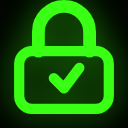

  
  <h1>CrytoTool</h1>
  

    
    
    
    
    
    
    
    
    
    
    
    
    
  

CrytoTool respects the people behind the screen. It's a four-in-one, client-side encryption file manager, gallery, music player, and document viewer where your privacy comes first: no tracking, no ads, no data collection.

CrytoTool is compliant with the protocol and respects all the principles included in it: [protocol-3305](https://github.com/ObscuritySecurity/protocol-3305)

### Architecture Overview

CrytoTool uses a 100% client-side architecture with 4 layers of encryption:

| Layer | What it does | Key detail |
|-------|----------------|------------|
| **1. Database Encryption** | Auto-encrypts every file in IndexedDB | AES-256-GCM, keys from Master Password via Argon2id |
| **2. File & Folder Encryption** | Manual encryption with 6 algorithms | AES-GCM, XChaCha20-Poly1305, ChaCha20-Poly1305, AES-CTR, Salsa20-Poly1305, AES-GCM-Stream |
| **3. Encrypted Backup** | Creates secure backups of all data | PBKDF2-SHA256 + AES-256-GCM, unique 26-char key |
| **4. Streaming Encryption** | Handles large files on any device | 4MB chunks, AES-GCM per chunk, safe for low-RAM devices |

For full technical details, consult the [Technical Architecture](https://github.com/ObscuritySecurity/CrytoTool/blob/main/architecture.md).

---

### Key Features

**Advanced Security & Privacy**
-   **IndexedDB Encryption:** Files are automatically encrypted using AES-256-GCM with keys derived from your Master Password via Argon2id. For more details, see the [Technical Architecture](https://github.com/ObscuritySecurity/CrytoTool/blob/main/architecture.md) (Section 1).
-   **Strong Master Password:** Secure your entire vault with a master password (minimum 30 characters).
-   **Encrypted Backups:** Create fully encrypted backups protected by a unique, separate encryption key using PBKDF2-SHA256 and AES-256-GCM. For more details, see the [Technical Architecture](https://github.com/ObscuritySecurity/CrytoTool/blob/main/architecture.md) (Section 3).
-   **Critical Settings Password:** Add an optional, second password to protect access to sensitive settings.
-   **Progressive Lockout:** The app automatically locks for increasing durations after multiple failed password attempts.
-   **Self-Destruct Mechanism:** Optionally configure the app to automatically and securely wipe all data after a set number of failed attempts.
-   **Access Recovery:** Regain access to your vault if you lose your master password using either 10 single-use recovery codes or a unique, one-time reset token.
-   **Auto-Lock & Visual Obfuscation:** The app can automatically lock and blur the screen after a period of inactivity.

**Effortless Code Management**
-   **Add Codes Easily:** Add new 2FA accounts by entering details manually or by scanning a QR code from an image in your gallery.
-   **Powerful Search:** Instantly find any code by searching for its issuer or account name.
-   **Safe Deletion:** Move codes to a Trash area, from where you can restore them or delete them permanently.
-   **Manual & Streaming Encryption:** Encrypt files manually with 6 algorithms (AES-GCM, XChaCha20-Poly1305, ChaCha20-Poly1305, AES-CTR, Salsa20-Poly1305, AES-GCM-Stream). For more details, see the [Technical Architecture](https://github.com/ObscuritySecurity/CrytoTool/blob/main/architecture.md) (Sections 2 & 4).

**Deep Customization**
-   **Theme Gallery & Accent Colors:** Personalize the app's appearance with a rich theme gallery and a custom accent color picker.
-   **Multi-Language Support:** The interface is available in over 50 languages to provide a native experience for people worldwide.

### Screenshots

  <h3>Desktop & Mobile Views</h3>
  
  

    

      
      
Dashboard

    

    

      
      
Encryption

    

    

      
      
Settings

    

    

      
      
App Animation

    

  

---

### Documentation

Explore these guides to understand our project's principles, technical design, and how you can get involved.

-   [Code of Conduct](https://github.com/ObscuritySecurity/CrytoTool/blob/main/docs/CODE_OF_CONDUCT.md) Our pledge to maintain a harassment-free and inclusive community.
-   [Contributing Guide](https://github.com/ObscuritySecurity/CrytoTool/blob/main/docs/CONTRIBUTING.md) Instructions on how to contribute to the project.
-   [License](https://github.com/ObscuritySecurity/CrytoTool/blob/main/LICENSE)  AGPL-3.0 license under which this software is provided.
-   [Security Documentation](https://github.com/ObscuritySecurity/CrytoTool/blob/main/docs/SECURITY.md) Threat model, attack surface, and audit guidelines.
-   [Technical Architecture](https://github.com/ObscuritySecurity/CrytoTool/blob/main/docs/architecture.md) A deep dive into the technical design and encryption model.
-   [UI/UX Design Standards](https://github.com/ObscuritySecurity/CrytoTool/blob/main/docs/DESIGN.md) Design rules, terminology (people not users), visual language, accessibility, and i18n standards.
-   [API Documentation](https://github.com/ObscuritySecurity/CrytoTool/blob/main/docs/API.md) Public APIs for crypto services, database, and utilities.
-   [Development Guide](https://github.com/ObscuritySecurity/CrytoTool/blob/main/docs/DEVELOPMENT.md) Setup, workflows, and coding standards for developers.
-   [Release Guide](https://github.com/ObscuritySecurity/CrytoTool/blob/main/docs/RELEASE.md) How to create releases for web, desktop, and mobile.
-   [Changelog](https://github.com/ObscuritySecurity/CrytoTool/blob/main/docs/CHANGELOG.md) History of versions and changes.

### Contributors

Thank you to everyone who has contributed to CrytoTool!  
Special thanks to all the people who helped with code, documentation, testing, and translations.

<!-- Contributors: add yourself here or use @all-contributors bot -->
<!-- Format: - [@username](https://github.com/username) - contribution type -->

---

### Acknowledgements

CrytoTool is built on the shoulders of giants. We are deeply grateful for these open-source projects:

#### Core Crypto
- **[hash-wasm](https://github.com/Daninet/hash-wasm)** — Argon2id implementation for master key derivation
- **[libsodium-wrappers](https://github.com/jedisct1/libsodium.js)** — Audited ChaCha20, XChaCha20, Salsa20, BLAKE2b primitives

#### Framework & UI
- **[Tauri](https://tauri.app/)** — Secure, lightweight desktop backend
- **[Capacitor](https://capacitorjs.com/)** — Cross-platform mobile framework
- **[React](https://react.dev/)** — UI library
- **[Tailwind CSS](https://tailwindcss.com/)** — Utility-first CSS framework
- **[Framer Motion](https://www.framer.com/motion/)** — Animation library

#### Inspiration
- **[Protocol-3305](https://github.com/ObscuritySecurity/protocol-3305)** — The foundational protocol guiding our privacy-first principles

---

### Spread the mission

We do not need your money. We need your voice.

Our mission is to build software that respects people, and that mission can only succeed if people know there is a better way. If you believe in this project, the most valuable contribution you can make is to share it.

Talk about it. Write about it. Show it to your friends. Help us prove that a private, secure, and respectful internet is not only possible—it's necessary.
