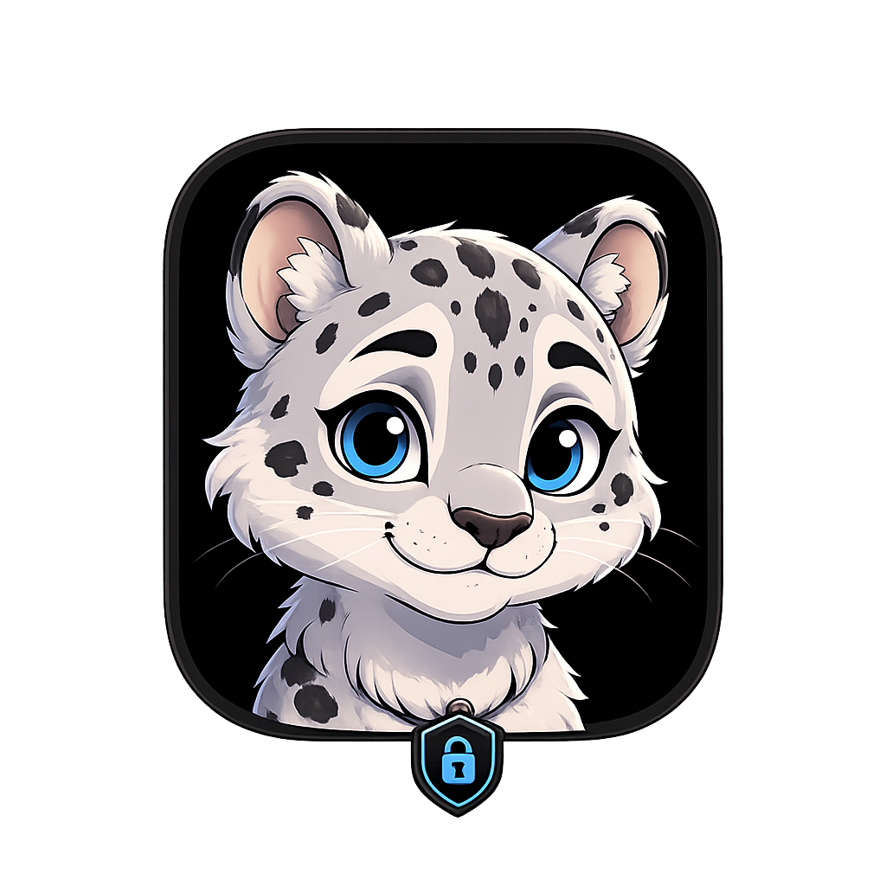
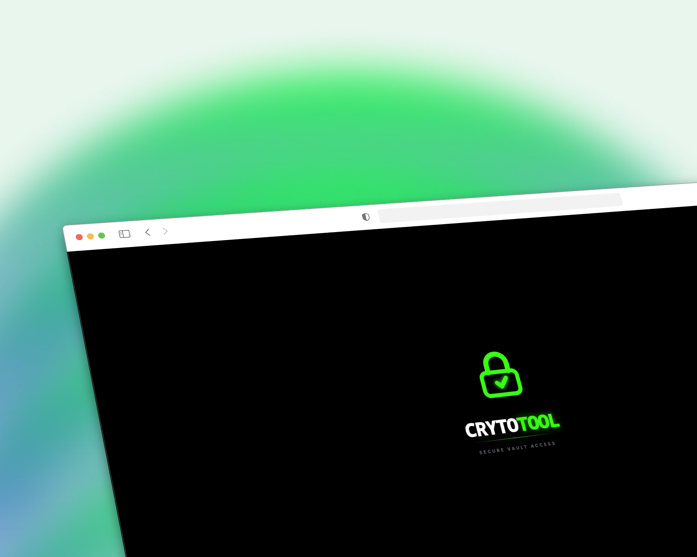
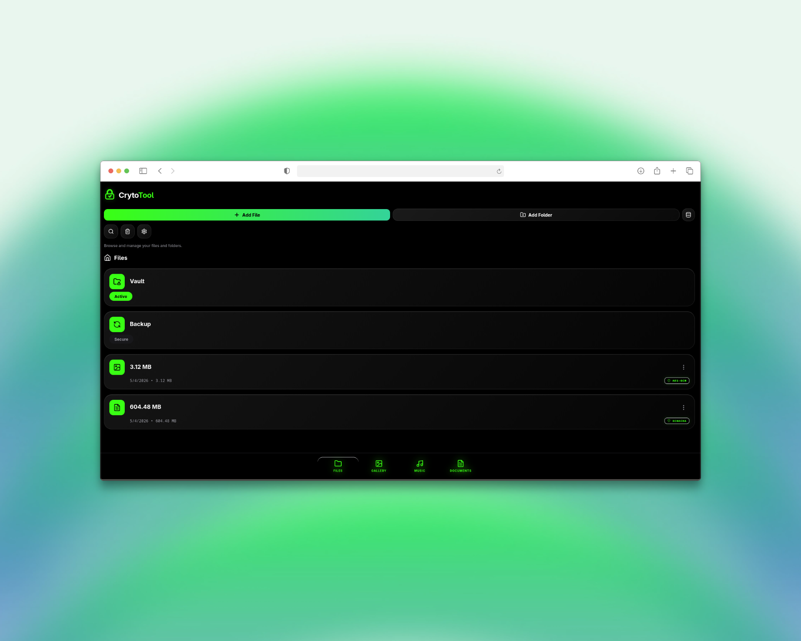
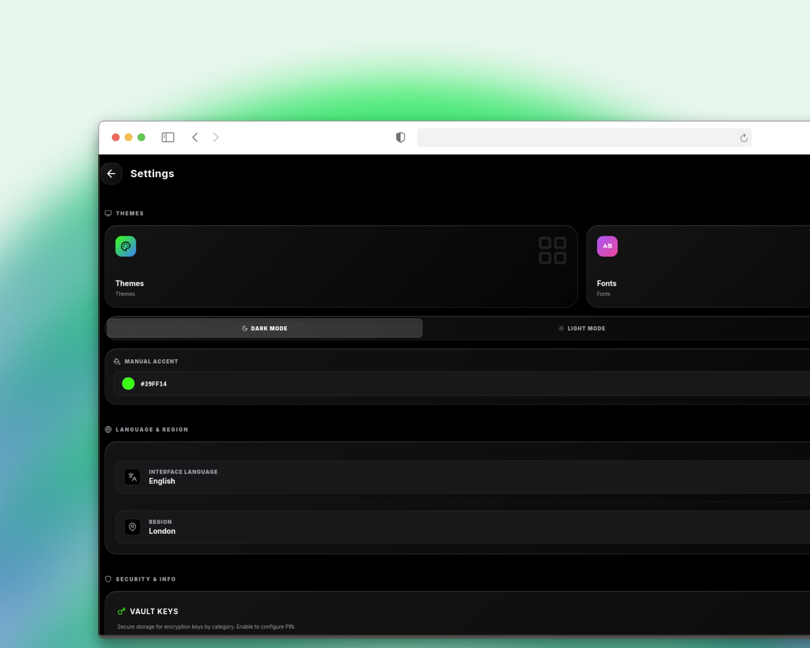

  
  <h1>Privon Vault</h1>
  
<strong>All-in-One Privacy.</strong>

   
       
   
     
   
       
   
   
  

  

|  Concept & Brand |  Interface Overview |
| :---: | :---: |
|  |  |
| *brand & animation* | *File Management* |

|  Advanced Security |  Deep Customization |
| :---: | :---: |
|  |  |
| *Multiple encryption algorithms* | *Themes & Personalization* |

Privon Vault respects the people behind the screen. It's a All-in-One Privacy, client-side encrypted Vault file manager, gallery, music player, and document viewer where your privacy comes first: **no tracking, no ads, no data collection**.

File names, tags, and metadata are encrypted — not just file contents. It works independently of the operating system, fully sandboxed.

Privon Vault is compliant with the [Protocol-3305](https://github.com/ObscuritySecurity/protocol-3305) and respects all its principles.

Privon Vault adapts to your needs and your individual threat model configures settings, features, technical parameters, and even the interface because security should not be reserved exclusively for experts with a very intuitive and visually pleasing design based on liquid glass.

The glass interface is extremely intuitive — welcome screen, choose threat model, and the application configures everything for you. Models include Everyday Privacy — with subcategories for higher threat models: Journalists, Activists, Whistleblowers.

Attention: high threat models are disabled by default until audit. We do not put lives at risk and do not create false impressions.
impressions.

See the full [Threat Model & Security Features](https://github.com/privonn/PrivonVault/blob/main/docs/SECURITY.md) for details.

### No Software Is Perfect

No software is perfect — including Privon Vault. That's exactly why we need a community. Bugs, vulnerabilities, and edge cases will always exist. The difference between good software and great software is **transparency** and **how actively you work with the people who use it**.

Privon Vault is open source so anyone can audit the code, report issues, suggest improvements, or contribute fixes. We don't hide behind closed doors. Every vulnerability found is a chance to make the project stronger. Every bug reported helps protect the people who trust us with their data.

If you find something, [report it](https://github.com/privonn/PrivonVault/issues). If you can fix something, [open a pull request](https://github.com/privonn/PrivonVault/blob/main/docs/CONTRIBUTING.md). Security is not a product — it's a process, and we build it together.

**Audit Status:** The Privon Vault codebase has not yet undergone a professional third-party security audit. Professional audits are expensive, and as a community-driven project we don't have the budget for one yet. We hope to fund a full audit in the future. Until then, the code is open for anyone to review — and we encourage you to do so. If you find a vulnerability, please [report it privately](https://github.com/privonn/PrivonVault/security/advisories/new). We prioritize security — vulnerability remediation and response will be as fast as possible.

> **AI-Assisted Workflow:** This project is architected by [wtshex1](https://github.com/wtshex1) — an autodidact in cybersecurity, digital privacy design, and artificial intelligence — who defines the architecture, security model, and product vision. [Scuris](https://github.com/Scuris) is the autonomous AI agent that implements features, documentation, and fixes under that direction. Every commit is reviewed before merging into `main`, ensuring human oversight at every step.

### Architecture Overview

Privon Vault uses a 100% client-side architecture with 4 layers of encryption:

| Layer | What it does | Key detail |
|-------|----------------|------------|
| **1. Database Encryption** | Auto-encrypts every file in IndexedDB | AES-256-GCM, keys from Master Password via Argon2id |
| **2. Manual Encryption** | Manual encryption with 6 algorithms | AES-GCM, XChaCha20-Poly1305, ChaCha20-Poly1305, AES-CTR, Salsa20-Poly1305, AES-GCM-Stream |
| **3. Encrypted Backup** | Creates secure backups of all data | Argon2id + AES-256-GCM, unique 26-char key |
| **4. Streaming Encryption** | Handles large files on any device | 4MB chunks, AES-GCM per chunk, safe for low-RAM devices |

For full technical details, consult the [Technical Architecture](https://github.com/privonn/PrivonVault/blob/main/docs/ARCHITECTURE.md).

---

### Problems Solved

> **1. Real security, not a facade.** Most file managers rely on the operating system password alone — a single layer that offers little real protection. Privon Vault uses an isolated, client-side architecture with multiple independent encryption layers.

> **2. One app, not many.** People are tired of juggling separate tools for files, photos, music, and documents. Privon Vault replaces them all in a single, unified, privacy-first environment.

> **3. Choice of encryption.** Most file managers lock you into one algorithm. Privon Vault gives you six — AES-256-GCM, ChaCha20-Poly1305, XChaCha20-Poly1305, AES-CTR, Salsa20-Poly1305, and AES-GCM-Stream — selectable per file.

---
### Key Features

**Security**
-   **Master Password (30+ characters):** Secure your entire vault with a strong master password (minimum 30 characters).
-   **Progressive Lockout:** The app automatically locks for increasing durations after multiple failed password attempts.
-   **Settings Password:** A separate, dedicated password with capability to protect sensitive settings this option is optional
-   **Self-Destruct:** self-destruction of the database after incorrect attempts of the Master password configurable this option is optional 
-   **Auto-Lock & Visual Obfuscation:** The app can automatically lock and blur the screen after a period of inactivity.
-   **Unique Key Per File/Folder:** Each file and folder is encrypted with its own unique encryption key, stored securely in the vault with progressive lockout protection.
-   **PIN Blacklist:** Common and weak PINs are blocked from use, preventing easy-to-guess combinations.
-   **Encrypted Backup Key:** Backups are protected with a unique, separate encryption key

**Recovery**
-   **10 Recovery Codes:** Generate 10 unique, single-use codes for emergency vault access
-   
-   **Encrypted Backups:** Create fully encrypted backups of all your data.

**File Management**
-   **File Manager:** Add files, add folders, rename, duplicate, move, copy, download, encrypt, decrypt
-   **Storage Overview:** View storage space by file type (photos, videos, music, documents)
-   **Search:** Search across all folders and files
-   **Trash:** Delete and restore files and folders

**Multiple Models**
-   **Gallery:** View photos and videos, favorites, albums *(photo/video editor coming soon)*
-   **Music:** Listen to songs, browse albums, artists, playlists
-   **Documents:** View standard document formats *(document editor and viewer coming soon)*
-   **Vault:** Store encryption keys, categorized for easy access
-   **Encrypted Backup:** Backup or restore the entire application from `.enc` file
-   **Settings:** Customize all preferences and security options

**Deep Customization**
-   **Themes:** 100 themes across multiple categories
-   **Fonts:** 40+ fonts across multiple categories
-   **Dark / Light / System mode**
-   **Custom accent color** via built-in color picker
-   **Icon packs:** 10+ icon packs for folders and files, or upload your own
-   **Labels:** Add custom labels to organize content
-   **50+ languages:** Full interface translation

---

### Documentation

Explore these guides to understand our project's principles, technical design, and how you can get involved.

-   [Code of Conduct](https://github.com/privonn/PrivonVault/blob/main/docs/CODE_OF_CONDUCT.md) Our pledge to maintain a harassment-free and inclusive community.
-   [Contributing Guide](https://github.com/privonn/PrivonVault/blob/main/docs/CONTRIBUTING.md) Instructions on how to contribute to the project.
-   [License](https://github.com/privonn/PrivonVault/blob/main/LICENSE)  AGPL-3.0 license under which this software is provided.
-   [Security Documentation](https://github.com/privonn/PrivonVault/blob/main/docs/SECURITY.md) Threat model, Report vulnerabilities 
-   [Technical Architecture](https://github.com/privonn/PrivonVault/blob/main/docs/ARCHITECTURE.md) A deep dive into the technical design and encryption model.
-   [UI/UX Design Standards](https://github.com/privonn/PrivonVault/blob/main/docs/DESIGN.md) Design rules, terminology (people not users), visual language, accessibility, and i18n standards.
-   [API Documentation](https://github.com/privonn/PrivonVault/blob/main/docs/API.md) Public APIs for crypto services, database, and utilities.
-   [Development Guide](https://github.com/privonn/PrivonVault/blob/main/docs/DEVELOPMENT.md) Setup, workflows, and coding standards for developers.
-   [Release Guide](https://github.com/privonn/PrivonVault/blob/main/docs/RELEASE.md) How to create releases for web, desktop, and mobile.
-   [Changelog](https://github.com/privonn/PrivonVault/blob/main/docs/CHANGELOG.md) History of versions and changes.

### Contributors

Thank you for helping make Privon Vault better for everyone. We build this project with love and respect for every single person who contributes.

  
  

 

Want to see your name here? Check the [Contributing Guide](https://github.com/privonn/PrivonVault/blob/main/docs/CONTRIBUTING.md) to get started.

---

### Acknowledgements

Privon Vault is built on the shoulders of giants. We are deeply grateful for these open-source projects and standards:

#### Core Crypto
- **[Rust crypto-core crate](https://github.com/privonn/PrivonVault/tree/main/crypto-core/src)** — All encryption runs through a single Rust crate compiled to WASM. AES-256-GCM, Argon2id, ChaCha20-Poly1305, XChaCha20-Poly1305, Salsa20-Poly1305, AES-CTR + HMAC — all audited implementations, no JS crypto code.
- **[aes-gcm](https://docs.rs/aes-gcm)** — AES-256-GCM encryption (12-byte nonce, NIST SP 800-38D)
- **[argon2](https://docs.rs/argon2)** — Argon2id key derivation with threat-model-adaptive parameters (configurable iterations, memory, parallelism per tier)
- **[wasm-bindgen](https://github.com/rustwasm/wasm-bindgen)** — The bridge that compiles Rust to WebAssembly, making native crypto available in the browser
- **[wasm-pack](https://rustwasm.github.io/wasm-pack/)** — Build tool for the Rust→WASM pipeline
- **[chacha20poly1305](https://docs.rs/chacha20poly1305)** — ChaCha20-Poly1305 (IETF RFC 8439) and XChaCha20-Poly1305 implementations
- **[xsalsa20poly1305](https://docs.rs/xsalsa20poly1305)** — Salsa20-Poly1305 (XSalsa20+Poly1305) implementation
- **[Web Crypto API](https://www.w3.org/TR/WebCryptoAPI/)** — Used for cryptographically secure random IV and salt generation (`getRandomValues`)
- **[NIST SP 800-38D](https://nvlpubs.nist.gov/nistpubs/legacy/sp/nistspecialpublication800-38d.pdf)** — The AES-GCM standard that governs our encryption

#### Framework & Runtime
- **[Tauri](https://tauri.app/)** — Secure, lightweight desktop and mobile backend (Rust + WebView)
- **[React](https://react.dev/)** — UI library (v19)
- **[TypeScript](https://www.typescriptlang.org/)** — Type safety across the entire codebase
- **[Vite](https://vitejs.dev/)** — Build tool and dev server (v8)
- **[Tailwind CSS](https://tailwindcss.com/)** — Utility-first CSS framework
- **[Framer Motion](https://www.framer.com/motion/)** — Animation library
- **[Rust](https://www.rust-lang.org/)** — Systems language powering both the crypto layer and Tauri backend

#### Icons & Fonts
- **[Lucide](https://lucide.dev/)** — Beautiful icon set
- **[Heroicons](https://heroicons.com/)** — Icon set by the Tailwind team
- **[Fontsource](https://fontsource.org/)** — Self-hosted open-source fonts (17 font families)

#### Inspiration
- **[Protocol-3305](https://github.com/ObscuritySecurity/protocol-3305)** — The foundational protocol guiding our privacy-first principles

---

### Spread the mission

We do not need your money. We need your voice.

Our mission is to build software that respects people, and that mission can only succeed if people know there is a better way. If you believe in this project, the most valuable contribution you can make is to share it.

Talk about it. Write about it. Show it to your friends. Help us prove that a private, secure, and respectful internet is not only possible—it's necessary.

 

  <b>Privon Vault</b> — built with respect for people and their data.
   
  🇷🇴 Made with ❤️ in România 
  <a href="https://github.com/privonn/PrivonVault/blob/main/LICENSE">AGPL-3.0 License</a>

